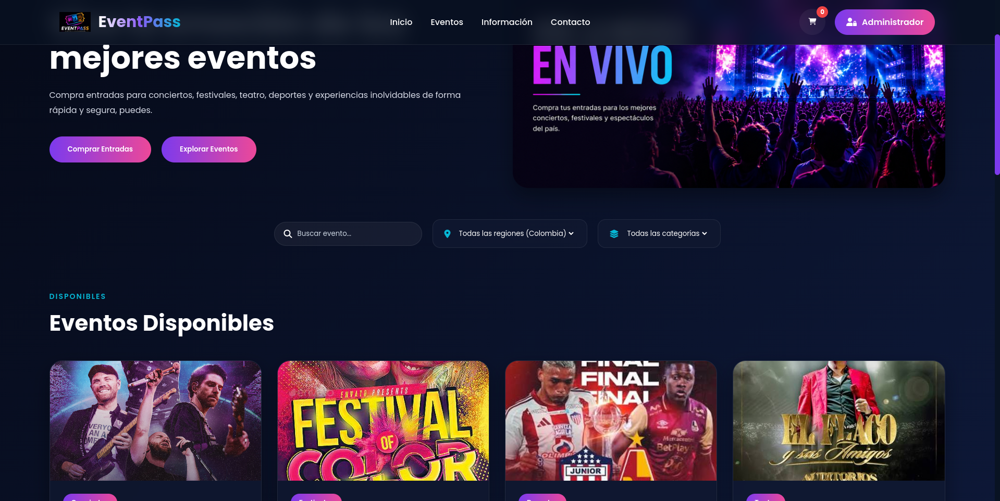
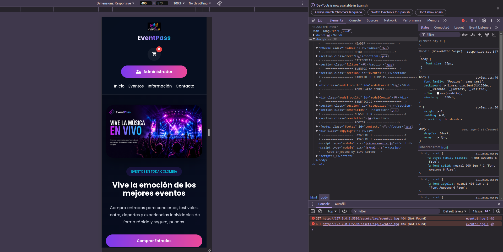
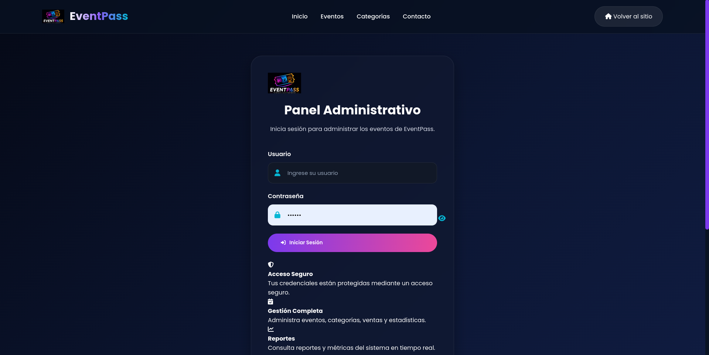
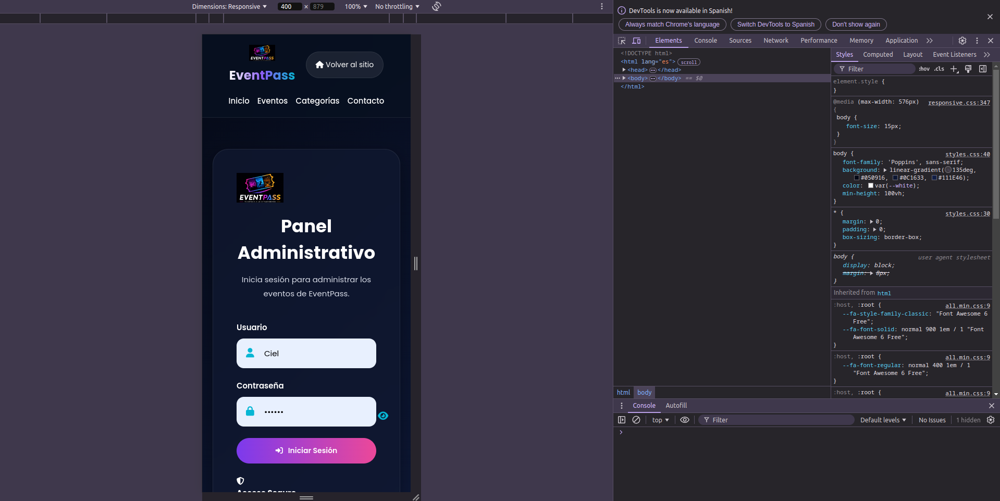
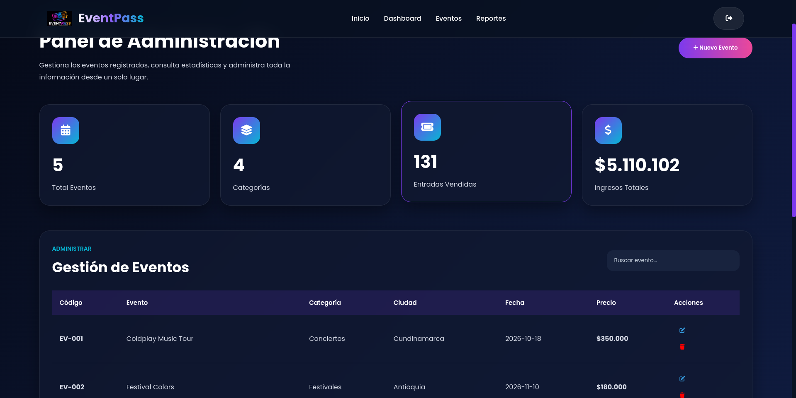
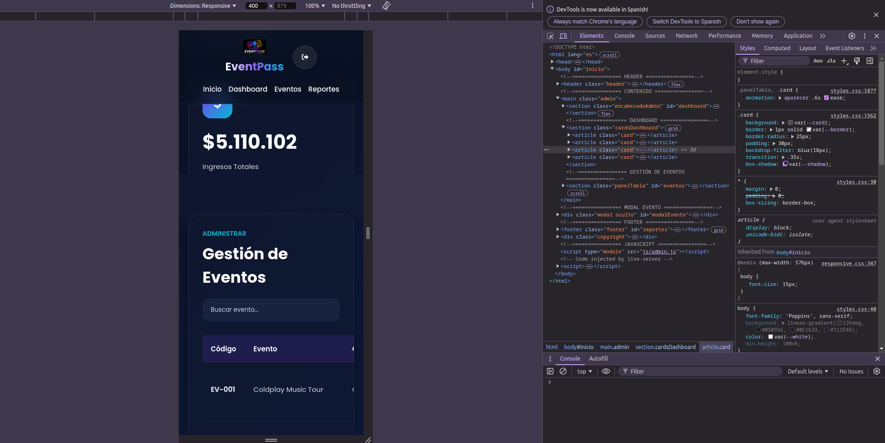

# Proyecto-javascript_Proyecto_Conciertos_CovillaDuvan_MedinaBrayan

EVENTPASS - PLATAFORMA DE GESTIÓN Y VENTA DE ENTRADAS
====================
DESCRIPCIÓN DEL PROYECTO
EventPass es una aplicación web interactiva diseñada para la visualización, filtrado y compra de entradas a eventos, junto con un panel administrativo completo para la gestión del inventario de espectáculos y el análisis de métricas de ventas. El sistema funciona completamente en el lado del cliente (Frontend) y utiliza el almacenamiento local del navegador para mantener la persistencia de los datos, simulando el comportamiento de una base de datos real.

Visualmente, el proyecto destaca por una interfaz moderna con una estética espacial que utiliza fondos oscuros, gradientes en tonos morados y cian, y componentes interactivos con efectos de desenfoque tipo Glassmorphism.

====================
TECNOLOGÍAS Y CÓMO SE USARON EN JAVASCRIPT

El núcleo y la inteligencia de EventPass están desarrollados con JavaScript modular moderno (ES6 Modules). A continuación se detalla qué se usó y cómo funciona cada módulo del sistema:

ARQUITECTURA DE MÓDULOS (import / export)
Se utilizó para dividir el código en archivos independientes y especializados, evitando que las variables se mezclen y facilitando el mantenimiento del proyecto.

PERSISTENCIA DE DATOS (LocalStorage + JSON)
Implementado en 'storage.js'. Debido a que el navegador solo guarda texto plano, se utilizó JSON.stringify() para empaquetar los objetos y arreglos de JavaScript antes de guardarlos, y JSON.parse() para desempaquetarlos al leerlos. Esto permite que el carrito, los eventos creados y el histórico de compras no se borren al recargar la página.

PROGRAMACIÓN ASÍNCRONA (Async / Await + Fetch API)
Utilizado en 'data-seed.js', 'main.js' y 'admin.js'. Se usó para realizar peticiones en segundo plano sin congelar la pantalla del usuario. 'data-seed.js' hace un fetch hacia un archivo local 'json/eventos.json' para cargar 5 eventos de prueba la primera vez que se abre la app. Por otro lado, 'main.js' y 'admin.js' consumen una API pública externa para traer los departamentos oficiales de Colombia en tiempo real.

COMPONENTES WEB NATIVOS (Web Components)
Implementado en 'components.js'. Se creó una etiqueta de HTML personalizada llamada . JavaScript se encarga de fabricar la estructura interna de la tarjeta de forma automática leyendo los atributos de la etiqueta, inyectando los datos y dándole formato de dinero colombiano con .toLocaleString('es-CO').

COMUNICACIÓN POR EVENTOS PERSONALIZADOS (Custom Events + Event Bubbling)
Para conectar componentes aislados, el botón "Añadir al carrito" de la tarjeta genera un CustomEvent llamado 'agregar-carrito'. Al activar las propiedades 'bubbles: true' y 'composed: true', el evento viaja hacia arriba por el árbol HTML hasta que el script global en 'main.js' lo escucha, atrapa los datos del evento y actualiza la bolsa de compras.

DELEGACIÓN DE EVENTOS (.closest() y Event Targets)
Utilizado en la tabla del administrador y en la lista del carrito para mejorar el rendimiento. En lugar de asignarle un escuchador de clics a cientos de botones individuales, se le asigna un único escuchador al contenedor padre. Al hacer clic, .closest() detecta con precisión si tocaste un botón de eliminar o editar (leyendo su atributo data-codigo), incluso si pulsaste exactamente encima del ícono visual.

MÉTODOS DE ARREGLOS AVANZADOS (Filter, Map, Reduce, Some y Set)

.filter(): Se usó para los buscadores y filtros por ciudad/categoría, y para expulsar elementos al eliminar un evento o ítem del carrito.

.map(): Se usó para actualizar los datos de un evento editado dentro de la lista global de espectáculos.

.reduce(): Se usó para calcular de forma limpia la sumatoria total del dinero en la factura multiplicando el precio de cada ítem por su cantidad.

.some(): Se usó como validación de seguridad en el formulario para impedir el registro de un evento con un código duplicado.

new Set(): Se usó para extraer las categorías existentes de los eventos y eliminar automáticamente los nombres repetidos, mostrando la métrica exacta en el dashboard.

====================
VISTAS DEL PROYECTO
El proyecto se compone de tres interfaces principales conectadas entre sí:

====================
VISTA: TIENDA / CLIENTE (index.html)
Es el portal principal para los usuarios. Cuenta con un encabezado con una burbuja flotante que indica la cantidad de boletas en el carrito, una sección de filtros en tiempo real (por texto, región y categoría) y una cuadrícula adaptativa donde se renderizan los eventos disponibles. Al abrir el carrito lateral, se despliega el desglose de los productos y un botón para proceder al pago, el cual abre un segundo modal de facturación que genera un tiquete de compra con un código aleatorio (ej. TK-45812).

====================
VISTA: INICIAR SESIÓN (iniciar.html)
Formulario de acceso seguro para el equipo de administración. Valida los datos ingresados contra un objeto de credenciales fijas. Cuenta con un sistema visual interactivo que altera el tipo de input entre 'password' y 'text' acompañado de un cambio de ícono (ojo abierto / ojo tachado) para permitirle al usuario visualizar u ocultar su contraseña antes de enviarla. Si el acceso es concedido, deshabilita el botón de envío para evitar múltiples interacciones y redirige al panel en 1.5 segundos.

====================
VISTA: PANEL DE ADMINISTRACIÓN (admin.html)
El centro de control del negocio. En la parte superior muestra un dashboard analítico con cuatro tarjetas informativas sincronizadas: Total de Eventos, Categorías Únicas, Entradas Vendidas e Ingresos Totales en Pesos Colombianos. En la parte inferior incluye una tabla interactiva con todos los espectáculos creados, barra de búsqueda y botones de acción rápida para eliminar o editar. Cuenta con una ventana modal dinámica que adapta su título e interfaz: en modo creación permite escribir todos los datos, mientras que en modo edición bloquea el campo del código principal para proteger la integridad de los datos en el almacenamiento.

